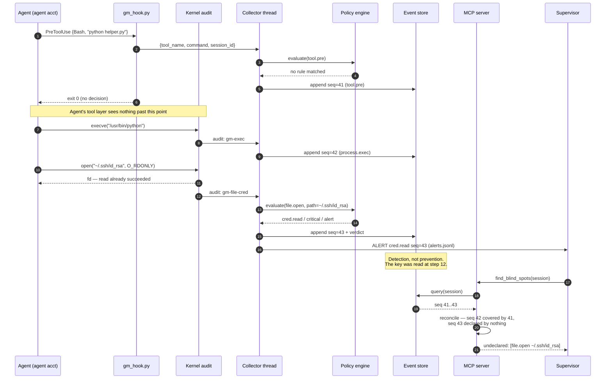
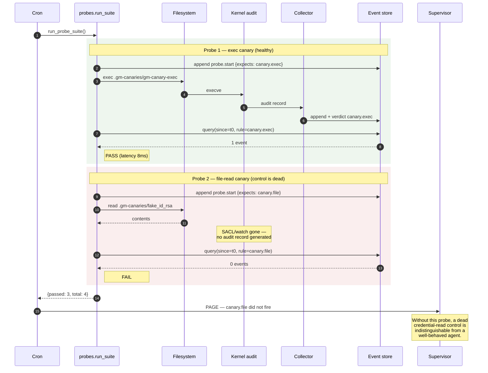

# guardrail-monitor — Design and Operations

How the monitor works, what it installs, how to run it, and how to configure
rules and access controls.

---

## 1. What it does

An AI coding agent runs with real filesystem, process, and network access.
Guardrails are placed around it — permission prompts, hooks, allowlists,
sandboxes. **This project answers one question: are those guardrails actually
working right now?**

It answers it in three ways:

1. **Observe** everything the agent's process tree does at the OS level.
2. **Compare** that against what the agent's tool layer *said* it was doing.
3. **Prove** the controls still fire, on a schedule, using canaries.

The third is the part most monitoring projects skip, and the reason the other
two can be trusted.

---

## 2. Architecture

### 2.1 The constraint everything follows from

An MCP server is a tool the agent calls. If the monitor is something the agent
invokes, then anything the agent does *without* invoking it is invisible — and
that includes every subprocess spawned from `Bash`, which is where the
interesting activity lives.

So the MCP server is **not the sensor**. It is the read-only query surface over
sensors that run out-of-band, in a process the agent cannot reach.

It is also **not the sensor's host process**. An MCP server speaking stdio lives
exactly as long as the client that launched it: when stdin closes, `mcp.run()`
returns and the process exits. The sensors therefore run in their own
long-running process, `gm.monitor`, and the MCP server, `gm.server`, reads what
the monitor writes. Started as a service, the monitor keeps watching whether or
not any supervisor is connected.

```
                     ┌────────────────────────────────┐
   agent account ────│  Claude Code (or other agent)  │
                     └────┬──────────────────────┬────┘
                          │ hooks                │ syscalls
                          │ (declared intent)    │ (ground truth)
      ── ── ── ── ── ── ──┼── ── ── ── ── ── ── ─┼── ── trust boundary ── ──
                          ▼                      ▼
                    ingest socket        kernel audit facility
                    / named pipe         (auditd | ES | SysmonDrv)
                          │                      │
                          │                      ▼
                          │              collector daemon
                          │              (auditd | eslogger | Sysmon svc)
                          └──────────┬───────────┘
                                     ▼
                          ┌──────────────────────┐
   monitor account        │ gm.monitor           │──▶ alert / kill
   (service, long-lived)  │ normalize → policy   │──▶ alerts.jsonl
                          └──────────┬───────────┘
                                     ▼
                  hash-chained append-only log + status.json
                                     ▼
                          ┌──────────────────────┐
   supervisor account     │ gm.server (MCP, RO)  │──▶ supervisor session
   (per client session)   └──────────────────────┘
```

### 2.2 The three signals

| Signal | Source | Strength | Weakness |
|---|---|---|---|
| **Intent** | `PreToolUse` / `PostToolUse` hooks | Semantic — you know it was a `Write` to a named path, by which tool | In-band. Runs as the agent's account. Blind to subprocess activity |
| **Effect** | auditd / Endpoint Security / Sysmon | Unskippable. Every `execve`, `open`, `connect` | No semantics. A write is a write; you don't know why |
| **Divergence** | `reconcile.py` | Catches what neither catches alone | Needs per-workload tuning |

The third row is why this exists rather than a generic EDR deployment. When the
kernel observes an effect that no hook declared, you have found either an
evasion or a hole in your hook coverage. Both are findings.

---

## 3. Components

### 3.1 What this project ships

**Everything guardrail-monitor ships runs in user space. There are zero kernel
components in this repository.** No driver, no kernel module, no eBPF program
of our own. That is a deliberate trade — see §3.3 for what it costs you.

| # | Component | Form | Lifetime | Runs as |
|---|---|---|---|---|
| 1 | **Monitor process** (`python -m gm.monitor`) | Long-running Python process; no stdin, no stdout | Service / daemon | monitor account |
| 2 | **MCP query server** (`python -m gm.server`) | stdio MCP server, launched by a client | As long as its client | supervisor account |
| 3 | **Hook shim** (`hooks/gm_hook.py`) | Short-lived process | Per tool call | **agent account** |

That is the whole shipped surface: **three executables, one persistent.**

The two Python processes share nothing but files, all under the log directory:

| File | Written by | Read by | Contents |
|---|---|---|---|
| `GM_LOG` (`events.jsonl`) | monitor (server appends `probe.start`) | server | Every event, hash-chained. Appends take a cross-process lock |
| `GM_ALERT_LOG` (`alerts.jsonl`) | monitor | your pager | One JSON line per `action: alert` verdict |
| `GM_STATUS` (`status.json`) | monitor, every `GM_STATUS_INTERVAL` | server | Heartbeat, collectors **alive**, sessions, tracked pids |
| `events.jsonl.monitor.lock` | monitor | monitor | Held for life; a second monitor on the same log refuses to start |

The monitor process is single-process, multi-threaded:

| Thread | Module | Job |
|---|---|---|
| `gm-ingest` | `collectors.IngestServer` / `collectors_win.NamedPipeIngest` | Accept hook events |
| `gm-auditd` / `gm-eslogger` / `gm-sysmon` | `collectors.LineJSONCollector` / `collectors_win.EventLogCollector` | Read the kernel feed |
| `gm-proctree` | `collectors.ProcTreeCollector` | psutil fallback (dev only) |
| `gm-session-reaper` | `sessions.SessionReaper` | Drop dead sessions |
| main | `monitor.Monitor.run()` | Health check and heartbeat every `GM_STATUS_INTERVAL` |

All threads funnel into one function, `Monitor.ingest()`, which evaluates policy
and appends to the store. Nothing bypasses it.

The health check tests `is_alive()`, not what was started. A collector that
dies -- a Sysmon subscription refused a millisecond after start is the usual
case -- is written into the event log as `monitor.collector_died`, logged to
stderr, and dropped from `collectors_running`. When no kernel-level collector
is alive the monitor says so on stderr.

### 3.2 Kernel components it depends on (not shipped)

| Platform | Kernel component | Supplied by | User-space daemon |
|---|---|---|---|
| Linux | `kauditd` audit subsystem | Kernel, built in | `auditd` |
| Linux (alt) | eBPF program | You, via bpftrace/Falco | `bpftrace` |
| macOS | Endpoint Security framework | Apple, built in | `eslogger` |
| Windows | `SysmonDrv.sys` minifilter + ETW providers | Sysinternals | `Sysmon64` service |

**Count: 1 kernel component per platform, none of them ours.** On Windows,
arguably two, since ETW providers are separate from the Sysmon minifilter.

### 3.3 What "no kernel component" costs

Enforcement is **post-hoc, not preventive.** By the time an `open()` event
reaches the monitor and `action: kill` fires, the read already completed. This
is a genuine TOCTOU gap, not an implementation shortcut:

```
 t0  agent calls open("~/.ssh/id_rsa")
 t1  kernel completes the read          ← the secret is already in memory
 t2  audit record written
 t3  monitor reads, evaluates, SIGKILLs ← ~1–50ms too late
```

So be honest about what each control actually is:

| Control | Prevents? | Notes |
|---|---|---|
| Hook `permissionDecision: "deny"` | **Yes** | The only true pre-execution gate. But in-band |
| Sandbox / container / ACL | **Yes** | Enforced by the OS, not by us |
| `action: kill` | No — **contains** | Stops continuation, not the act itself |
| `action: alert` | No — **detects** | The honest default |

**Use the sandbox for prevention and this monitor for verification.** A monitor
is not a substitute for containment; it tells you whether your containment
held.

---

## 4. Install, run, uninstall

### 4.1 Linux

```bash
# install
pip install "mcp>=1.0,<2" pyyaml psutil   # mcp 2.x cannot import gm.server
sudo useradd -r -s /usr/sbin/nologin gmmonitor
sudo install -d -o gmmonitor -g gmmonitor -m 0750 /var/log/gm /run/gm
sudo auditctl -R collectors/audit.rules
sudo auditctl -l                      # verify the rules loaded

# run the monitor (as a systemd unit in production; it needs no terminal)
sudo -u gmmonitor GM_LOG=/var/log/gm/events.jsonl \
                  GM_POLICY=/etc/gm/policy.yaml \
                  GM_SOCK=/run/gm/ingest.sock \
                  python -m gm.monitor

# then register the query server with a SUPERVISOR client -- see 4.5

# uninstall
sudo auditctl -D                      # drop all audit rules
sudo rm -f /run/gm/ingest.sock
# keep /var/log/gm — it is the evidence, archive before deleting
```

Remove the hook block from the project's `.claude/settings.json`.

### 4.2 macOS

```bash
pip install "mcp>=1.0,<2" pyyaml psutil
# Grant the terminal (or the monitor's launchd job) Full Disk Access in
# System Settings → Privacy & Security. eslogger will not run without it.
GM_LOG=~/Library/Logs/gm/events.jsonl python -m gm.monitor
```

Uninstall is just stopping the process; `eslogger` is a client, not a daemon,
and installs nothing.

### 4.3 Windows

```powershell
pip install "mcp>=1.0,<2" pyyaml psutil pywin32
.\collectors\setup-windows.ps1 -AgentAccount "HOST\agent" -ValidateOnly   # checks, changes nothing
.\collectors\setup-windows.ps1 -AgentAccount "HOST\agent" -SysmonPath C:\Tools\Sysmon\sysmon64.exe

# GM_LOG defaults to %ProgramData%\gm\events.jsonl and GM_POLICY to the
# policy.windows.yaml next to the package, so neither needs setting.
python -m gm.monitor
```

Run the monitor as a scheduled task or service that starts at boot, under the
monitor account, **not** in a console you might close. The preflight refuses
an agent account that does not exist, a monitor that would run as the agent
(block 6's Deny would lock it out of its own log), and a missing Sysmon binary
-- before anything on the machine is changed. See WINDOWS.md for the full
walkthrough.

Uninstall — reverse the setup script, in this order:

```powershell
sysmon64.exe -u                                              # remove driver
auditpol /set /subcategory:"File System" /success:disable    # object access
Remove-Item "HKLM:\SOFTWARE\Policies\Microsoft\Windows\PowerShell\ScriptBlockLogging" -Recurse
# Remove the SACLs you added:
$acl = Get-Acl -Path "C:\Users\agent\.ssh" -Audit
$acl.SetAuditRuleProtection($false, $false)
$acl.RemoveAuditRuleAll(($acl.GetAuditRules($true,$false,[System.Security.Principal.NTAccount])[0]))
Set-Acl -Path "C:\Users\agent\.ssh" -AclObject $acl
```

`setup-windows.ps1` changes machine-wide audit policy. Read it before running
it, and reverse it when you are done — leaving object-access auditing on will
quietly fill the Security log on a busy host.

### 4.4 Environment variables

| Variable | Default | Purpose |
|---|---|---|
| `GM_LOG` | `/var/log/gm/events.jsonl`; `%ProgramData%\gm\events.jsonl` on Windows | Event log path |
| `GM_POLICY` | `policy.yaml` (`policy.windows.yaml` on Windows) beside the `gm` package — not the working directory, which an MCP client chooses | Rule file |
| `GM_ALERT_LOG` | `alerts.jsonl` beside `GM_LOG` | One JSON line per alert. Tail it into your paging path |
| `GM_STATUS` | `status.json` beside `GM_LOG` | Monitor heartbeat read by the MCP server. Must match in both processes |
| `GM_STATUS_INTERVAL` | `5` | Seconds between health checks. The server calls a heartbeat stale after 3× this (at least 15s) |
| `GM_SOCK` | `/run/gm/ingest.sock` | Hook transport (POSIX) |
| `GM_PIPE` | `\\.\pipe\gm-ingest` | Hook transport (Windows). Read by **both** the shim and the monitor — change it in one place only and the two halves talk past each other |
| `GM_HOOK_TIMEOUT` | `1.5` | Seconds the shim waits on the transport before giving up. Keep it well under the hook's own `timeout` |
| `GM_AGENT_PID` | unset | Enables the psutil fallback |
| `GM_TRACER` | `auto` | Force `auditd` / `eslogger` |
| `GM_FAIL_OPEN` | `1` | Hook behavior when the monitor is unreachable |
| `GM_SECURITY_LOG` | `1` | Windows: 4663 file-read collector |
| `GM_PWSH_LOG` | `1` | Windows: 4104 script block collector |
| `GM_CANARY_IP` | `192.0.2.1` | Egress-probe target. TEST-NET-1, so the connect is issued and then never routed. Must stay an **address**, not a name — a name that fails to resolve means no `connect()` ever happens and the probe reports FAIL forever |
| `GM_CANARY_PORT` | `443` | Port for the egress probe |

### 4.5 Registering the query server

`gm.server` is launched by an MCP client, in a **supervisor** session, never
the agent's. It needs the same `GM_LOG`, `GM_POLICY` and `GM_STATUS` as the
monitor (the defaults already agree), plus the package on its path:

```bash
claude mcp add guardrail-monitor -e PYTHONPATH=/opt/gm -- /opt/gm/venv/bin/python -m gm.server
```

It runs no collectors and exits with its client, which is harmless: the
monitor keeps writing. Every tool that reports on collectors or sessions
carries a `monitor` block, and says `running: false` with a reason when the
heartbeat is missing, stale, or the monitor stopped.

---

## 5. Monitoring an agent

### 5.1 Wiring

1. **Start `gm.monitor` first**, as a service. A hook that fires before the
   socket or pipe exists is a silently lost event.
2. **Install the hooks** into the monitored project's `.claude/settings.json`
   from `hooks/settings.example.json`. Use `matcher: "*"` — narrow matchers are
   how blind spots get in.
3. **Run the agent as a separate account**, in its own cgroup or Job Object.
4. **Register the MCP server in a different session** than the one being
   monitored. This is not optional; see §7.1.
5. **Run the probe suite** before trusting anything.

### 5.2 The operating loop

| Cadence | Action | Tool |
|---|---|---|
| Continuous | Page on `action: alert` rules | tail `GM_ALERT_LOG` (out of band) |
| Continuous | Page when the heartbeat goes stale or a collector dies | `control_coverage` → `monitor` |
| Per session | Review what the agent touched | `session_summary` |
| Per session | Check for undeclared activity | `find_blind_spots` |
| Hourly (cron) | Prove the controls still fire | `run_probe_suite` |
| Daily | Check for dead rules | `control_coverage` |
| Daily | Confirm the log is intact | `verify_log_integrity` |

### 5.3 MCP tools

| Tool | Answers |
|---|---|
| `query_events` | What happened, filtered by kind/session/time |
| `list_violations` | What tripped a rule, above a severity floor |
| `session_summary` | Binaries run, hosts contacted, files written, rules tripped |
| `find_blind_spots` | Where declared intent and observed effect diverge |
| `verify_log_integrity` | Has the log been edited or truncated |
| `run_probe_suite` | Are the controls firing *right now* |
| `control_coverage` | Which rules fire, which have never fired |
| `list_sessions` | Which agents are registered, from where, in which directory |
| `list_agents` | Which agent processes are running, and which lack hook coverage |
| `attribution_health` | What fraction of OS events could not be tied to a session |

There is deliberately **no tool to mute a rule, delete an event, or stop a
collector.** Those are config-file operations, done out of band by a human.

---

## 5A. Agents and sessions

### 5A.1 What counts as "the agent"

The OS layer is agent-agnostic: it watches a **process subtree**, so Claude
Code, Cursor, Aider, or something homegrown are all monitorable. The hook layer
is Claude Code-specific. That split matters:

| Agent | Ground truth | Declared intent | Reconciliation |
|---|---|---|---|
| Claude Code (any surface) | yes | yes, via hooks | **yes** |
| Cursor / Aider / homegrown | yes | no hook API | **no** |

For an agent with no hook support you get a complete record of what it did and
no record of what it meant to do. `find_blind_spots` is unavailable, because
there is nothing to diff against.

### 5A.2 How it locates the agent

**Nothing scans for the agent by default; the agent self-registers.**
`hooks/gm_hook.py` runs as a child of the agent process, so it walks up its own
parent chain past any intermediate shell and reports the agent PID alongside
the `session_id`. On the first tool call the monitor learns
`session_id -> root PID`, and the launch surface is read from the ancestors.

This is why CLI vs VS Code vs JetBrains needs no separate handling. The agent
binary is identical in all three; only the parents differ:

```
CLI:        bash → claude                  → surface "cli"
VS Code:    code → extension-host → claude → surface "vscode"
JetBrains:  idea → claude                  → surface "jetbrains"
```

Attribution then propagates by process ancestry: every `process.exec` carries a
ppid, and a child inherits its parent's session, so a bash subprocess three
levels deep still resolves. For PIDs first seen mid-session — the monitor was
restarted, or started after the agent — `SessionRegistry` walks live ancestry
with psutil until it finds something known, then memoizes the answer.

`list_agents()` scans the host independently and marks which discovered agents
have hook coverage. **A process there with no matching session is an agent
running unmonitored** — that cross-reference is the point of the tool.

Note the three mechanisms answer different questions, and only the second is
about identity:

| Mechanism | Scopes by | Decides |
|---|---|---|
| `audit.rules` / Sysmon config | account (`auid`, `User`) | what is captured at all |
| Hook registration + ancestry | process tree | which agent an event belongs to |
| `GM_AGENT_PID` | one pid subtree | the psutil dev fallback only |

### 5A.3 Multiple agents

Supported, and this is what the registry is really for.

- Each session is anchored to its own root PID and process subtree.
- `resolve()` **never guesses.** An unattributable event stays `unknown` rather
  than being assigned to whichever session is active — a wrong attribution puts
  one agent's actions in another's summary, which is worse than a visible gap.
- PID reuse is guarded by comparing process create-time. Without that, a
  recycled PID silently inherits a dead session's attribution.
- Containment is per-agent via the `outside_session_workspace` predicate. A
  single global `${workspace}` breaks as soon as two agents work in two repos:
  whichever repo is not in `policy.yaml` has every write flagged.

What is still global, and therefore still a reason to prefer **one monitor per
agent** when the agents differ materially: the rule set itself, the sensor
account filters in `audit.rules` / `sysmon-config.xml`, `GM_AGENT_PID`, and the
three monitor-wide tools (`verify_log_integrity`, `run_probe_suite`,
`control_coverage`). `control_coverage` in particular aggregates across agents,
so a rule that fired for A but never for B reports as "fired". Since `GM_LOG`,
`GM_POLICY` and `GM_SOCK`/`GM_PIPE` are all environment variables, running N
monitors costs nothing structurally.

### 5A.4 The attribution trade, stated plainly

`outside_session_workspace` **does not fire when the session is unknown.**
Firing would mean a flood of false violations on every unattributed event; not
firing means unattributed events escape workspace containment.

That is a real hole, deliberately chosen, and it is why `attribution_health()`
exists. Check `unknown_rate` before trusting a quiet `session_summary` — a
broken PID bridge and a well-behaved agent produce the same empty report. This
is the same failure shape as a dead collector (§6.2), and it wants the same
treatment: **alert on the health metric, not just on violations.**

Two known causes of unattributed events: the collector started mid-session and
the ancestry walk failed, or the agent has no hooks installed so nothing ever
registered a root PID. `list_agents()` distinguishes them.

---

## 6. Sequence diagrams

### 6.1 Use case A — undeclared credential read (the case that motivates the design)

The agent writes a helper script and runs it. The script reads a private key.
The hook sees `Bash("python setup_helper.py")` and nothing more; the kernel
sees the actual `open()`. This is exactly the gap the reconciler closes.



**What the operator learns:** not just that a key was read, but that it was
read through a path the hook layer never saw. That distinction is what tells
you the guardrail has a structural gap rather than a one-off bad command.

### 6.2 Use case B — control-efficacy probe catching a dead collector

A `git clean` deleted and recreated a watched directory. On Linux the `auditctl
-w` watch survives; on Windows the SACL does not. The log goes quiet and looks
perfectly healthy.



**Why this matters:** the failure in probe 2 produces *no* log entry. There is
nothing to alert on, no error, no gap in a counter. The only way to detect it
is to trip the control on purpose. Alert on probe FAIL as loudly as on a
violation.

---

## 7. Configuration

### 7.1 Access controls

These are the things that quietly undo a monitor like this.

| Control | Linux / macOS | Windows |
|---|---|---|
| Monitor identity | Separate uid (`gmmonitor`) | Separate local account |
| Agent containment | cgroup / container | Job Object / AppContainer |
| Log protection | `0640`, owned by monitor uid | Explicit **Deny** ACE for agent account |
| Ingest transport | Socket `0666` (write-only by protocol) | Named pipe DACL: `FILE_WRITE_DATA` only |
| MCP query process | Read access to the log dir; never the agent's uid | `setup-windows.ps1 -ReaderAccount` (read only) |
| Audit config | `auditctl -e 2` (immutable to reboot) | ACL the Sysmon service + sign the config |
| Off-box copy | syslog / S3 object-lock | Windows Event Forwarding |

Five rules that carry most of the weight:

1. **Do not attach this MCP server to the agent being monitored.** An agent
   that can query its own monitor can learn precisely which of its actions were
   invisible.
2. **The agent must not be able to signal the monitor.** Different uid,
   different cgroup. If the agent can `kill` the collector, the collector is
   decorative.
3. **Ship events off-box immediately.** The hash chain *detects* tampering; it
   does not prevent someone with write access from truncating and rebuilding.
4. **The hook shim is not a control.** It runs inside the blast radius. Use it
   for signal; put enforcement where the agent cannot reach it.
5. **Watch your own config.** `fs.agent_config_write` fires if anything writes
   to `.claude/settings.json`, `.mcp.json`, or `policy.yaml`. An agent editing
   its own guardrails is the highest-signal event in the system.

### 7.2 Rule schema

```yaml
vars:
  workspace: /home/agent/project     # ${workspace} expands in any match value

rules:
  - id: cred.read                    # unique; referenced by probes and coverage
    description: Agent read a credential store.
    kind: [file.open, file.read]     # which canonical events this applies to
    src: [auditd]                    # optional: restrict to one collector
    severity: critical               # low | medium | high | critical
    verdict: violation               # allow | warn | violation
    action: alert                    # log | alert | kill
    match:                           # ALL predicates must hold (AND)
      path_glob: ["~/.ssh/**", "**/*.pem"]
```

Multiple rules can match one event; every match contributes a verdict.

**Event kinds**

| Kind | Emitted by | Platforms |
|---|---|---|
| `tool.pre`, `tool.post` | hook shim | all |
| `process.exec` | auditd / ES / Sysmon 1 / PowerShell 4104 | all |
| `file.open`, `file.read` | auditd / ES / **Security 4663** | all |
| `file.write`, `file.create`, `file.unlink` | auditd / ES / Sysmon 11, 23, 26 | all |
| `net.connect` | auditd / ES / Sysmon 3 | all |
| `net.dns` | Sysmon 22 | Windows |
| `registry.write` | Sysmon 12–14 | Windows |
| `probe.start`, `enforce.kill`, `monitor.start`, `monitor.stop`, `monitor.collector_died` | monitor itself | all |

**Predicates**

| Predicate | Matches when | Notes |
|---|---|---|
| `path_glob` | `data.path` matches any glob | Case-insensitive on Windows via `normcase` |
| `path_under` | path is inside any listed root | |
| `path_not_under` | path is outside all listed roots | Containment against fixed roots |
| `outside_session_workspace` | path is outside **this session's** cwd, plus any listed extra roots | Per-agent containment. Does **not** fire when the session is unknown — see §5A.4 |
| `key_glob` | registry key matches | Windows; not a filesystem path |
| `argv_regex` | command line matches any regex | **Add `(?i)` on Windows** |
| `exe_not_in` | binary is not on the allowlist | |
| `host_not_in` | hostname is not on the allowlist | Suffix match on subdomains |
| `port_in` | destination port is in the set | |
| `tool_name_regex` | hook `tool_name` matches | `tool.pre`/`tool.post` only |
| `content_regex` | written content matches | Secret detection pre-write |

Adding a predicate: write the function in `policy.py` and register it in the
`PREDICATES` dict. Unknown keys are rejected at load time, so a typo fails
loudly at startup rather than silently never matching.

### 7.3 Writing rules that hold up

- **Every rule needs a probe.** A rule with no probe is a rule you are guessing
  about. If `control_coverage` shows it in `never_fired` and no probe covers
  it, treat it as broken until proven otherwise.
- **Start with `action: alert`.** `kill` turns a monitoring false positive into
  an availability incident, and given §3.3 it is containment rather than
  prevention anyway. Earn your way to `kill`.
- **Severity floors beat rule counts.** Thirteen rules that page correctly beat
  a hundred that get muted in week two.
- **Case sensitivity is a real bypass.** On Windows, `path_not_under` without
  `normcase` and `argv_regex` without `(?i)` are both one capital letter from
  being defeated. Both bugs were found by porting; assume the next rule you add
  has the same flaw until tested.
- **Prefer allowlists for egress, denylists for exec.** You know your build
  hosts; you cannot enumerate every dangerous command.

### 7.4 Tuning knobs

| Where | Knob | Why you'd touch it |
|---|---|---|
| `reconcile.WINDOW_SECONDS` | 30s | Long builds need a wider window |
| `reconcile._covers()` | Bash/PowerShell heuristics | Currently permissive — a Bash call credits any egress in its window. **Add `"powershell"` to the tool sets on Windows** |
| `probes.run_suite(settle=)` | 2.0s | Raise for batching tracers; a FAIL from impatience is worse than no probe |
| `store.query()` | full scan | Fine to ~10⁵ events; move to SQLite past that and keep JSONL as the tamper-evident record |

---

## 8. Scope

**In scope:** what the process actually touched, and whether the guardrail
noticed.

**Out of scope:** model reasoning, prompt-injection resistance, whether a code
change was a good idea. Pair this with transcript-level review for the semantic
half — the two are complementary and neither substitutes for the other.
